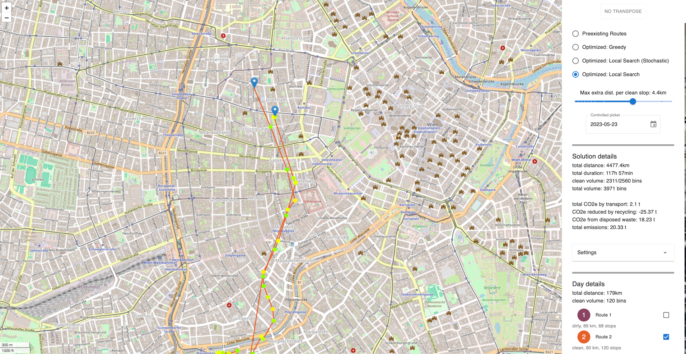

# ♻️ Knowledge Graph-Driven Tour Optimization for Sustainable Waste Collection

This repository contains the code and experiments accompanying the master's thesis:  
**“[Knowledge Graph-Driven Tour Optimization for Sustainable Waste Collection](https://doi.org/10.34726/hss.2025.124320)”**  
by Adrian Bracher under the supervision of Markus Nissl and Emanuel Sallinger @ TU Wien

Our work has been supported by the [Vienna Science and Technology Fund WWTF](https://www.wwtf.at) under the project [NXT22-018](https://www.wwtf.at/funding/programmes/vrg/VRG18-013/). 


# ✨ Summary
The project investigates the use of knowledge graphs to predict pollution levels at waste collection stops and optimize the routes accordingly. It combines semantic representations, statistical and ML models, and custom heuristics to provide a practical and sustainable solution for a real-world waste management challenge.

---

## 📦 Structure

The code is structured in four components:
  - `application`: The main logic component. Used for (1) KG creation, incl. preprocessing, (2) routing algorithm,s (3) REST API for the frontend
  - `frontent`: Web-based GUI for solution visualization and KG creation
  - `KGE`: Supporting code to apply knowledge graph embeddings TransE, PairRE, TuckER
  - `probabilistic-predictions`: computes and saves stochastic models in the KG. Supported are: normal distribution, Student's t-distribution, Bayesian normal distribution model, Bayesian mixture model

---

## ▶️ How to Use

The components are supplied as Docker containers, which can be started individually through the ```docker compose up``` command in the respective directory.

### KG Creation
1. Make sure that `application`, `frontend`, a Neo4j or Memgraph instance, and an OSRM instance are running, the default ports are 4000, 4001, 3000, and 5001, respectively. Data is assumed to be supplied via a MongoDB instance running on port 27017 in the same Docker network.
2. Visit [localhost:4001/create](http://localhost:4001/create/) for KG creation. Layers must be created in this order: LAYER_1 > LAYER_2 > other layers.

### Application Service
KG creation and reasoning may also be done via the HTTP API (default port 4000). 

For example, to create a solution layer, execute the following command. Note that the placeholder must be replaced with one of LAYER_PREEXISTING, LAYER_GREEDY, LAYER_LS. Before running the local search (LAYER_LS), [LKH](http://webhotel4.ruc.dk/~keld/research/LKH/) must be downloaded to the `application` directory and compiled, which can be done by executing the script `./set-up-lkh.sh`.

### KGE Service
The `KGE` service can also be started via ```docker compose up```, which executes reasoning (enriching predicted pollution tags in the KG) and/or hyperparameter tuning for the various models.

### Probabilistic Prediction Service
Start the `probabilistic-predictions` service via the command ```docker compose up```, which enriches attributes of waste collection stops in the KG that describe the trained models.

---

## 🖼️ Screenshots

We also provide a user-friendly graphical interface for visualizing, configuring, and exploring problem and solution data. The default URL for the GUI is [localhost:4001](http://localhost:4001/).


*Screenshot of the solution, i.e., scheduled routes, of a day (with anonymized locations).*


*Pollution overview for a route stop.*


